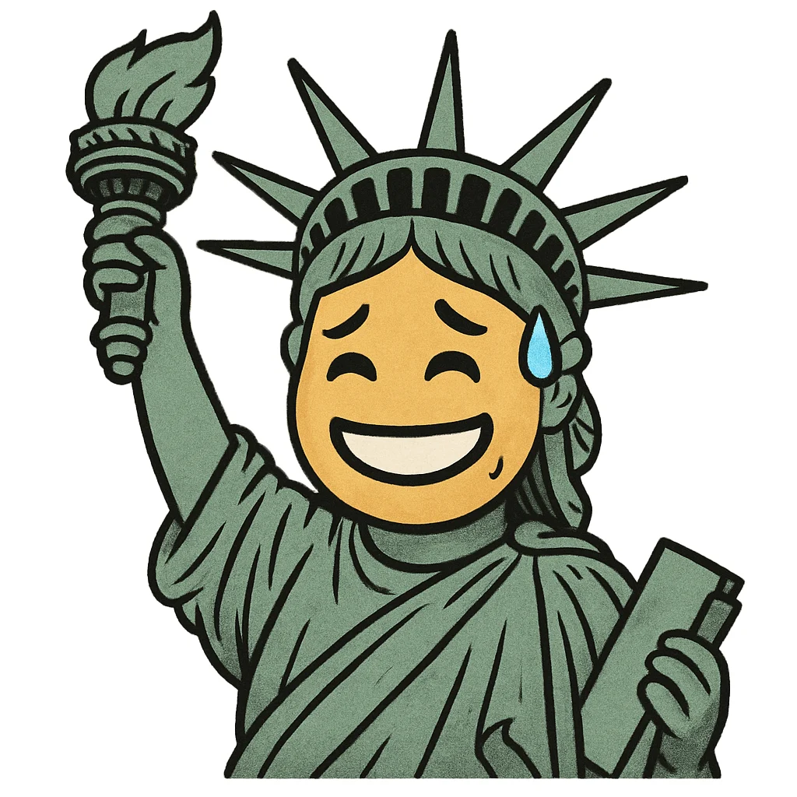

<div align="center">


# YouTube发评反诈-油猴

一个YouTube实时评论检查器，自动检查评论状态，防止评论被儿童偷偷误食你还被蒙在鼓里！

</div>

## YouTube会暗地里对你的评论干那些坏事？

- **直接无声无息的删除**
  - 删除你评论是不会发通知告知的，例如“评论已被移除”
  - 被系统删除后，不刷新网页，给评论添加条回复，提交会报错：“未能添加你的回复，请重试。”，修改评论内容，报错“Returned error”。添加回复和修改评论的API请求HTTP状态码：404
  - 不会出现在视频发布者的“待审核”评论列表里，没有办法使其正常显示，**作者也不知道你发了这条评论**
- **Shadow Ban（仅自己可见/暂缓显示）**
  - 发送提示成功，并正常出现在自己账号下的评论列表里，不出现无账号或未登录下的评论列表。
  - 一般会出现在视频发布者的”待审核“评论列表里，视频作者点击“批准”后可正常显示，此处的评论将在 60 天后移除。除非作者在视频的设置内，将【评论和评分】->【管理】从默认的“基本”调整为“无”。如果你不想每次上传视频都设置一遍，可以到**频道的设置**，【社区管理】 -> 【内容控制】->【新视频和帖子的评论设置】->【评论】->【管理】调整为“无”
  - 评论发布者不知道评论正处于待审核状态（除非你用[官方API](https://developers.google.com/youtube/v3/docs/commentThreads/list?hl=zh-cn) ID定位，查询[`moderationStatus`](https://developers.google.com/youtube/v3/docs/comments?hl=zh-cn#snippet.moderationStatus)的值，即值为`heldForReview`，注意要使用Google OAuth 2.0认证才能获取自己的待审核的评论，而key不能。因为需要申请api使用权限，所以懂编程的自己研究，本脚本不使用此api）
- **在热门列表中屏蔽**
  - 你的评论没被系统删除也没被ShadowBan，但禁止显示在热门排序的列表中，即翻遍整个热门排序下的列表也找不到你的评论。
  - 有时，评论区的评论较少时，你能明显发现评论数量不对劲，比如显示有5个评论但你只看见了3个，换到按时间就看到少的那几个了，就是这个原因。
  - 若你的评论被热门屏蔽，不会进入例如“暂缓显示”这样的列表，内容作者无法让你被热门屏蔽的评论在热门列表中正常显示！
  - 若你的评论此前是暂缓显示的（即ShadowBan），之后视频作者放行了你的评论，你的评论也只能在按时间排序里显示，不会出现在热门排序里。或者视频的评论管理等级为“无”，但在其他为“基本”的评论区会遭到ShadowBan的同内容评论，在此评论区就是热门屏蔽！
  - **触发阈值比前两项高得非常非常的多**，甚至可能高于某些中国大陆平台将评论屏蔽的阈值，稍带点负面情绪或别的原因就不能在热门中显示。甚至你随便找一个评论区（尤其是中文讨论政治的）做差集（最新-热门）就能**捞出一大把**。
  - 二级评论区即评论的回复，也会热门屏蔽！脑瘫的是，评论回复页没有排序方式的选择，它的排序方式是按照当前评论区的排序方式来的😅。回复数量的显示数值也是正确按照当前排序方式来的，使得你难以察觉回复里有被热门屏蔽的评论。要看被热门屏蔽的评论回复？那你就拼命的从按时间排序翻到那条根评论吧🤡。所以，**非常建议检查回复评论是否被热门屏蔽**！！！因为你的评论若被热门屏蔽就同等于被ShadowBan了。再就是评论回复的数量相比一级评论区来说不会太夸张，遍历热门列表不会消耗太多时间。
  - 算YouTube专利了，妈的**比大陆平台还贱**，大陆平台我还没见这种屏蔽方式，评论没违规的情况下顶多把不好的评论放热门最底部但不会吞。
  - 视频作者在视频评论区评论较少时，观众发布评论，作者可以收到`XXX 发表以下评论：“xxx”`的通知。**如果评论被热门屏蔽，作者不会收到该通知**

**当然，如果你是视频的发布者，你发评论将不会有以上情况发生**

以上情况发生的概率：

热门屏蔽 > 默默删除 > Shadow Ban

## 唯一的知情权

当你发送评论“Fuck you”，会弹窗

> 请本着尊重他人的态度发表评论
>
> 如果不确定你的评论是否合适，请参阅我们的社区准则。
>
> 我们的处置是否有误？请告诉我们
>
> [仍然发布]  [修改]

明明这样不是最好的处理方式吗，非得学阿瓦隆？

## 功能

### 使用 

发送一条评论，新添加的评论下会插入一个评论检查器，每隔5秒检查一次评论状态。

由于YT的评论审查较为耗时不能瞬间完成，所以评论的审查不是阻塞的，而是异步进行的，在审查期间，你的评论可能正常显示或者仅自己可见。YT审查评论最终裁定时间不会超过2分钟，平均裁定时间在评论发布之后的30秒左右。

该脚本的逻辑是，评论发送后每5秒检查一次评论状态，实时显示每次检查的状态，相当于实时监控。评论检查期间不影响你看视频什么的。如果你不想等太长时间，还可以点击“确认当前状态”来结束监控，建议至少等个30秒再确认。后续你也可以到历史评论记录这来重新检查评论。

若评论检查结果为正常，可继续进行热门屏蔽的检查。热门屏蔽的检查需要遍历热门列表，检查耗时视评论数量而定，请留意评论区的评论数量！若你的评论是回复，则不必考虑评论数量。


### 支持的功能

- 支持的评论区
  - 视频（Shorts请使用[这个插件](https://greasyfork.org/zh-CN/scripts/487271-better-youtube-shorts)，将Shorts替换成正常的视频网页）
  - 帖子
  - 支持评论区根评论和在评论上的回复（楼中楼）
- 热门屏蔽检查（遍历热门评论列表实现）
- 历史评论记录
  - 跳转所在评论区（定位评论）
  - 更新评论的状态
  - 检查是否热门屏蔽
  - 复制评论
  - 删除记录（只删本地记录）
  - 历史检查记录，即状态等信息的改变历史
  - 在YouTube上删除评论，历史记录本地更新为用户自行删除了评论（别的设备操作无法同步）
  - 在YouTube上编辑评论，历史记录本地更新评论内容，重置状态为“还未检查”（别的设备操作无法同步）
- 评论区热门屏蔽评论搜索

### 阻止fetch被锁

如果你使用上该脚本提示：

> fetch已被提前锁定，替换失败，YouTube发评反诈可能无法正常工作。

原因是，YouTube网页在未知的条件下会在网页的头部最顶层插入一段脚本

```html
<!DOCTYPE html>
<html style="font-size: 10px;font-family: Roboto, Arial, sans-serif;" lang="zh-Hans-CN" darker-dark-theme
  darker-dark-theme-deprecate system-icons typography typography-spacing>

<head>
  <script id="bc-def" nonce="u3G5zv7J1R8Q5HD1sYq4aQ">
    'use strict';
    function a(b, c) {
      try {
        Object.defineProperty(b, c, {
          writable: !1,
          configurable: !1
        })
      } catch (d) { }
    }
    a(window, "fetch");
    a(window, "JSON");
    a(window.JSON, "stringify");
    a(window.JSON, "parse");
    a(window, "Array");
    a(Array.prototype, "push");
    a(Array.prototype, "forEach");
    try {
      const b = document.getElementById("bc-def");
      b && b.remove()
    } catch (b) { };
  </script>
  ……
</head>
……
</html>
```

疑似反制各类油猴脚本，将fetch、JSON.stringify等函数锁死，使其不能被替换。解决办法是，把Object.defineProperty也偷梁换柱，换成自己的，当调用时发现是fetch等函数时不做什么。

由于油猴脚本执行时机的问题，即使@run-at 调至 document-start 执行时机依旧太晚，油猴代码比锁定代码执行得晚，在油猴层面无法实现偷梁换柱。

所以得用插件实现，插件有比油猴更早的执行时机。

插件下载：[Define property blocker](https://github.com/freedom-introvert/youtube-comment-censor-detector/releases/tag/DPB-1.0)

下载插件后，将压缩文件解压，然后“加载已解压的扩展程序”，选择插件文件夹，即可安装。

## 小技巧

### 如何分享评论？

评论上的发送时间，如“1天前”这是一个链接，右键复制其链接，发给他人，别人粘贴到浏览器后，评论区就出现目标评论在第一条，即“所要查看的评论”。

当然，你若不使用该脚本，你还可以使用无痕模式来检查评论！对准评论的发送时间右击打开菜单，选择无痕窗口打开链接，这样就可以定位到“所要查看的评论”，如果没有“所要查看的评论”，那就有问题了。

### 如果评论区评论太多了，热门屏蔽还咋查？

YouTube的控评系统相比比国内的评论系统，它较为单纯，不会针对不同评论区设定不同的屏蔽内容（比如涉政的就把屏蔽阈值拉高）。

可以以此特性，拿你朋友发布的一个没有啥评论的视频作为小白鼠，在这条视频的评论区去发送你在别的评论区想要发的评论，如果评论在这里被屏蔽了，在别的评论区也一定会被屏蔽。当然，如果希望只作为小白鼠，不知道该发些什么视频？那就发一个一定不会被YouTube推荐的无意义视频（比如全程黑屏）。

严谨起见，如果目标评论区是视频那小白鼠应该是视频，如果目标评论区是帖子那小白鼠应该是帖子，如果是目标是在回复别人评论那小白鼠也是回复别人评论（被回复的是谁不必一样）。

## 致VPN用户

如果你遇到了几乎发送任何内容评论都立刻被删除，可能是你IP脏了。你需要换一个干净的节点，然后得等待足够的时间（约1小时这样）后才会恢复。

## 测试

### 一些测试用例


| 评论                                     | 测试结果          |
| ---------------------------------------- | ----------------- |
| 暖心                                     | 正常              |
| 真他妈不要脸                             | ShadowBan         |
| LGBT is shit                             | 系统删除/热门屏蔽 |
| DEI is shit                              | 热门屏蔽          |
| 习禁评                                   | 正常              |
| 庆丰帝                                   | 正常              |
| 共匪                                     | 系统删除/热门屏蔽 |
| this is a website https://www.google.com | 系统删除          |
| 可以看看我的频道                         | 系统删除          |
| 习近平下台                               | 热门屏蔽          |
| 特朗普下台                               | 正常              |

如果你想分享你的测试用例，可以提issues补充，最好是没有骂人但就是被屏蔽的那种。

同时我需要大量的测试用例来分析YouTube的评论审查系统是否有一定的**政治倾向性**

### 修改评论的测试

| 原评论       | 原状态    | 修改后       | 修改后状态                                |
| ------------ | --------- | ------------ | ----------------------------------------- |
| DEI is shit  | 热门屏蔽  | 暖心         | 热门屏蔽                                  |
| 暖心         | 正常      | LGBT is shit | 系统删除                                  |
| 暖心         | 正常      | 真他妈不要脸 | ShadowBan（未登录状态下正常显示了约20秒） |
| 暖心         | 正常      | DEI is shit  | 热门屏蔽                                  |
| 暖心         | 正常      | 喜欢！       | 正常                                      |
| 真他妈不要脸 | ShadowBan | 暖心         | 热门屏蔽                                  |

## 审查偏见

暂无数据

欢迎网友来投稿自己发送评论后那些被YouTube暗算的评论

## 吐槽

嘲笑我们中国有言论审查？想不到你阿美莉卡的YouTube也有“阿瓦隆”捏！

难绷美国宪法。言论自由？嘿，宪法只说了政府不能控制言论，没说社交平台不能啊🤓

控评随你吧，你想要维护社区氛围，这是你的自由，法律管不着，但请先给我们知情权！不要使用中国大陆社交平台一样龌龊的“诈骗”手段！

> PS：美国宪法第一修正案保障言论自由，适用于政府，不适用于私人公司。这或许导致了法院面对Tik Tok的言论审查问题时无法可依？


API设计者你不是有什么大病😅，常量数据写API里😅，Emoji选择器Emoji列表塞在每一条评论的对象下面，相当庞大的数据，可以直行用F12开发者工具自行感受。20条评论就有20x2条Emoji列表，造成相当大的流量和内存(RAM)浪费😅。

回复评论页还不能选排序方式，排序方式还得按照当前评论区的来？！

你他妈的API设计者是住了10年精神病院还是得了10年脑血栓？！😅

## 准备要做的功能

1. 评论回复列表强制使用按时间排序
1. 1的基础上加上同时搜索热门屏蔽评论，并在目标评论后显示这个是被屏蔽的

## LOGO

由ChatGPT生成

## 诉求

### 平台层面

可以要求用户好好交流，但不要使用不透明的审查手段，无论如何，用户都该知情。

- 除了用户自己，无论是谁删除了评论，都该告知用户评论已被谁移除。
- 若评论内容不合适，发送后需要经过作者的同意，也不应该一声不吭的让评论仅自己可见。合适的做法是告知评论发送者：您的评论内容可能不合适，需要经内容创作者同意后显示，期间你的评论不公开展示。
- 取消热门屏蔽，不友好的评论可以排后但不应屏蔽。 

### 法律层面

建议立法保障平台内容可见性的透明与用户知情权，明确平台在处理用户内容时的责任与边界：

> **【知情权保障】**
>  用户对其发布的内容拥有内容可见性的知情权。平台在隐藏、屏蔽、限制、降权任何用户内容时，必须以明确方式通知用户处理结果及理由。
>
> **【伪发布禁止】**
>  禁止平台向用户展示其内容“已成功发布”而实则不可公开展示的行为。若内容需审核、限制或延迟发布，平台应在发送时显著提示用户状态。
>
> **【非公开限制须告知】**
>  凡平台对用户内容施加“仅本人可见”“排序降权”“不予展示于热门”等非公开限制的，应向用户披露该限制的存在、类型与依据。
>
> **【透明记录义务】**
>  平台应保存用户内容的可见性状态变更记录，包括变更时间、类型、操作方及原因，用户有权随时查阅自身发布内容的状态记录。
>
> **【屏蔽审查机制】**
>  平台对内容实施非公开限制的依据，应当明确、公开、具体，并提供用户申诉、复核的流程与途径。
>
> **【非法限制的责任】**
>  若平台屏蔽、删除或降权未违反法律及平台公开准则的用户内容，用户可依法追责，平台应承担修复、赔偿及行政处罚等相应责任。

PS：【法律层面】是AI生成的并加以修改


欧盟好像有一个法案与我所说的类似

[《数字服务法》（DSA）第 17 条](https://www.eu-digital-services-act.com/Digital_Services_Act_Article_17.html)

