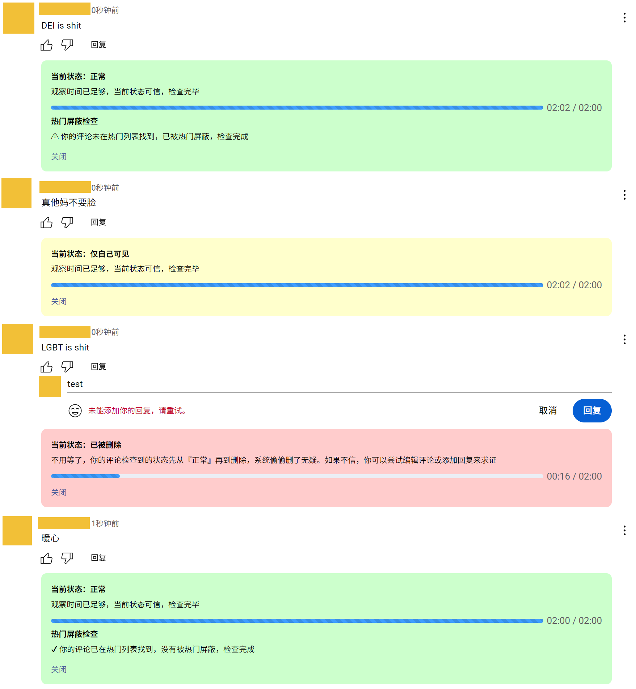

# YouTube发评反诈-油猴

一个YouTube实时评论检查器，自动检查评论状态，防止评论被儿童偷偷误食你还被蒙在鼓里！

## YouTube会对你的评论干那些坏事？

- **直接无声无息的删除**
  - 删除你评论是不会发通知告知的，例如“评论已被移除”
  - 被系统删除后，不刷新网页，给评论添加条回复，提交会报错：“未能添加你的回复，请重试。”，修改评论内容，报错“Returned error”。添加回复和修改评论的API请求HTTP状态码：404
  - 不会出现在视频发布者的“待审核”评论列表里，没有办法使其正常显示，作者也不知道你发了这条评论
- **Shadow Ban（仅自己可见）**
  - 发送提示成功，并正常出现在自己账号下的评论列表里，不出现无账号或未登录下的评论列表
  - 一般会出现在视频发布者的”待审核“评论列表里，视频作者点击“批准”后可正常显示，此处的评论将在 60 天后移除。除非作者在视频的设置内，将【评论和评分】->【管理】从默认的“基本”调整为“无”。该选项不会记录上次的选择，每当视频作者上传视频时，需要展开调整一次
- **在热门列表中屏蔽**
  - 你的评论没被系统删除也没被ShadowBan，但禁止显示在热门排序的列表中，即翻遍整个热门排序下的列表也找不到你的评论。
  - 有时，评论区的评论较少时，你能明显发现评论数量不对劲，比如显示有5个评论但你只看见了3个，换到按时间就看到少的那几个了，就是这个原因。
  - 若你的评论此前是暂缓显示的（即ShadowBan），之后视频作者放行了你的评论，你的评论也只能在按时间排序里显示，不会出现在热门排序里。
  - 触发阈值比前两项更高，甚至可能高于中国大陆平台将评论屏蔽的阈值，稍带点负面情绪就不能在热门中显示。

**当然，如果你是视频的发布者，你发评论将不会有以上情况发生**

## 唯一的知情权

当你发送评论“Fuck you”，会弹窗

> 请本着尊重他人的态度发表评论
>
> 如果不确定你的评论是否合适，请参阅我们的社区准则。
>
> 我们的处置是否有误？请告诉我们
>
> [仍然发布]  [修改]

明明这样不是最好的处理方式吗，非得学阿瓦隆？

## 功能

### 支持项

支持的评论区

- 视频（Shorts请使用[这个插件](https://greasyfork.org/zh-CN/scripts/487271-better-youtube-shorts)，将Shorts替换成正常的视频网页）
- 帖子

支持评论区根评论和在评论上的回复（楼中楼）

### 使用

发送一条评论，新添加的评论下会插入一个评论检查器，每隔5秒检查一次评论状态。

由于YT的评论审查较为耗时不能瞬间完成，所以评论的审查不是阻塞的，而是异步进行的，在审查期间，你的评论可能正常显示或者仅自己可见。YT审查评论最终裁定时间不会超过2分钟，平均裁定时间在评论发布之后的30秒左右。

该脚本的逻辑是，评论发送后每5秒检查一次评论状态，实时显示每次检查的状态，相当于实时监控。评论检查期间不影响你看视频什么的。如果你不想等太长时间，还可以点击“确认当前状态”来结束监控，建议至少等个30秒再确认。历史评论记录准备开发，发完评论后可再次到这里检查。

当然，你若不使用该脚本，你还可以使用无痕模式，对准评论的发送时间右击打开菜单，选择无痕窗口打开链接，这样就可以定位到“所要查看的评论”，如果没有“所要查看的评论”，那就有问题了。

### 一些测试用例

| 评论                                     | Result    |
| ---------------------------------------- | --------- |
| 暖心                                     | 正常      |
| 真他妈不要脸                             | ShadowBan |
| LGBT is shit                             | 系统删除  |
| DEI is shit                              | 热门屏蔽  |
| 习禁评                                   | 正常      |
| 庆丰帝                                   | 正常      |
| 共匪                                     | 系统删除  |
| this is a website https://www.google.com | 系统删除  |

如果你想分享你的测试用例，可以提issues补充，最好是没有骂人但就是被屏蔽的那种。

### 修改评论的测试

| 原评论       | 原状态    | 修改后       | 修改后状态                                |
| ------------ | --------- | ------------ | ----------------------------------------- |
| DEI is shit  | 热门屏蔽  | 暖心         | 热门屏蔽                                  |
| 暖心         | 正常      | LGBT is shit | 系统删除                                  |
| 暖心         | 正常      | 真他妈不要脸 | ShadowBan（未登录状态下正常显示了约20秒） |
| 暖心         | 正常      | DEI is shit  | 热门屏蔽                                  |
| 暖心         | 正常      | 喜欢！       | 正常                                      |
| 真他妈不要脸 | ShadowBan | 暖心         | 热门屏蔽                                  |

## 吐槽

嘲笑我们中国有言论审查？想不到你阿美莉卡的YouTube也有“阿瓦隆”捏！

难绷美国宪法。言论自由？嘿，宪法只说了政府不能控制言论，没说社交平台不能啊🤓

控评随你吧，你想要维护社区氛围，这是你的自由，法律管不着，但请先给我们知情权！不要使用中国大陆社交平台龌龊的“诈骗”手段！

API设计者你不是有什么大病😅，常量数据写API里😅，Emoji选择器Emoji列表塞在每一条评论的对象下面，相当庞大的数据，可以用F12开发者工具自行感受。造成相当大的流量和内存(RAM)浪费，20条评论就有20x2条Emoji列表😅。🤮

## 准备要做的功能

1. 评论历史记录（由indexedDB支持）
2. 评论热门屏蔽检测（需要翻整个热门列表，评论太多时不建议用）
3. 差评搜索机（时间排序-热门排序，做差集，特地筛选评论区被热门屏蔽的评论来看）

## LOGO

由ChatGPT生成